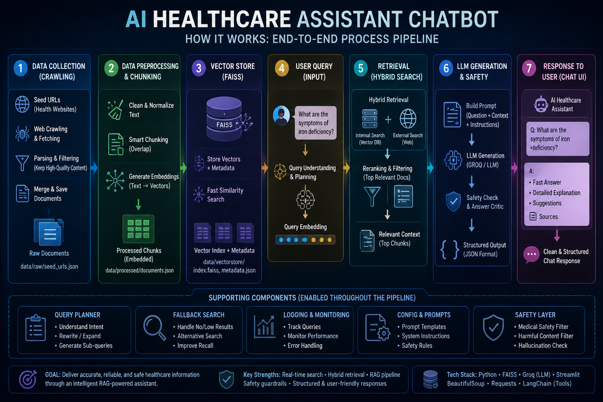

# 🏥 AI Healthcare Assistant Chatbot
---

## 🌐 Live Application: 

👉 https://tracynguyen01-ai-healthcare-assistant-app-qi6ci3.streamlit.app/

## Dashboard
<details>
  <summary>Click to expand</summary>
  <br/>
  <p align="center">
    
  </p>
</details>

---

## 📌 Overview

AI Healthcare Assistant is an intelligent chatbot designed to provide quick, reliable, and structured health-related information using Large Language Models (LLMs).

The system combines LLM reasoning + external knowledge tools to deliver:

Instant answers for common health questions
Safer, structured responses
Reduced hallucination through controlled outputs

👉 Built as a practical healthcare AI assistant prototype, focusing on usability and real-world deployment.

---
## ⚡ Key Highlights (Why this project stands out)


🧠 LLM + Tool Integration (RAG-style) → reduces hallucination vs normal chatbots


⚡ Fast + Structured Responses → not just text, but organized outputs


🔎 Search-Augmented Answers → grounded in external information


🧩 Robust JSON Parsing Pipeline → handles messy LLM outputs


🌐 Deployed Web App (Streamlit) → fully working product, not just notebook

---

## 🧠 How it works
```bash
User Question
   ↓
LLM (Groq / OpenAI)
   ↓
Tool Calling (Search API - Tavily)
   ↓
Structured Output (JSON Parsing)
   ↓
Streamlit Chat UI
```

💬 Example Capabilities


“What are symptoms of iron deficiency?”


“How to treat muscle pain at home?”


“When should I see a doctor for headaches?”


👉 Returns:


✅ Quick summary


📖 Detailed explanation


📌 Suggested next actions

---

## 🏗️ System Design
🔹 **1. LLM Layer**


- Handles reasoning and response generation


- Generates structured JSON output


🔹 **2. Tool Layer (Search API)**


- Retrieves relevant medical information


- Reduces hallucination


🔹 **3. Parsing Layer**
- Custom-built pipeline:


- Extracts JSON from raw LLM text


- Handles malformed responses


- Ensures consistent UI display


🔹 **4. Frontend (Streamlit)**


- Chat interface


- Real-time response rendering


- Clean and minimal UX

---

## 🗂️ Project Structure
```bash
📦 ai-healthcare-assistant
├── app.py                      # Streamlit chatbot entry point
├── requirements.txt
├── project_scope.md            # Project description & scope
├── README.md
├── LICENSE
├── .gitignore

├── data/
│   ├── raw/
│   │   └── seed_urls.json      # Initial URLs for crawling
│   ├── processed/
│   │   └── documents.json      # Cleaned & structured documents
│   └── vectorstore/
│       ├── index.faiss         # FAISS vector index
│       └── metadata.json       # Document metadata

├── src/
│   ├── crawler/                # Data collection pipeline
│   │   ├── crawl.py
│   │   ├── fetch.py
│   │   ├── parse.py
│   │   ├── save.py
│   │   ├── filters.py
│   │   ├── domain_rules.py
│   │   ├── ingest_medlineplus.py
│   │   └── merge_documents.py
│
│   └── utils/                  # Core RAG + LLM pipeline
│       ├── agentic_rag.py
│       ├── rag.py
│       ├── retrieve.py
│       ├── internal_retrieve.py
│       ├── external_retrieve.py
│       ├── hybrid_retrieve.py
│       ├── fallback_search.py
│       ├── embed.py
│       ├── chunking.py
│       ├── preprocess.py
│       ├── query_planner.py
│       ├── generate.py
│       ├── answer_critic.py
│       ├── safety.py
│       ├── prompts.py
│       ├── llm_parse.py
│       └── logger.py

├── tests/
│   ├── test_chunk.py
│   ├── test_fetch.py
│   ├── test_groq.py
│   └── test_parse.py
```
---
## 🚀 Run Locally
1. Clone repo
```bash
git clone: https://github.com/tracynguyen01/ai-healthcare-assistant
cd ai-healthcare-assistant
```
2. Setup environment
```bash
python -m venv venv
source venv/bin/activate
```
3. Install dependencies
```bash
pip install -r requirements.txt
```
4. Add API keys
```bash
Create .env:
GROQ_API_KEY=your_key
TAVILY_API_KEY=your_key
```
5. Run app
```bash
streamlit run app.py
```
---
## 🛠️ Tech Stack


Python


Streamlit


LLM APIs (Groq / OpenAI)


Tavily Search API


JSON parsing & validation

---

## 📊 Challenges & Solutions

| Challenge              | Solution                                  |
|-----------------------|-------------------------------------------|
| LLM hallucination     | Integrated search tool (RAG-style)         |
| Unstructured outputs  | Built JSON extraction pipeline            |
| API reliability       | Fallback parsing logic                    |
| UX clarity            | Structured response format                |

---
## 🔮 Future Improvements


- Vector database (true RAG system)


- Medical knowledge base integration


- User personalization


- Multi-language support


- Cloud scaling (AWS / GCP)

---

## ⚠️ Disclaimer
This project is for educational purposes only and does not replace professional medical advice.

---
## 👩‍💻 Author
**Ngoc Bao Tran (Tracy) Nguyen**


